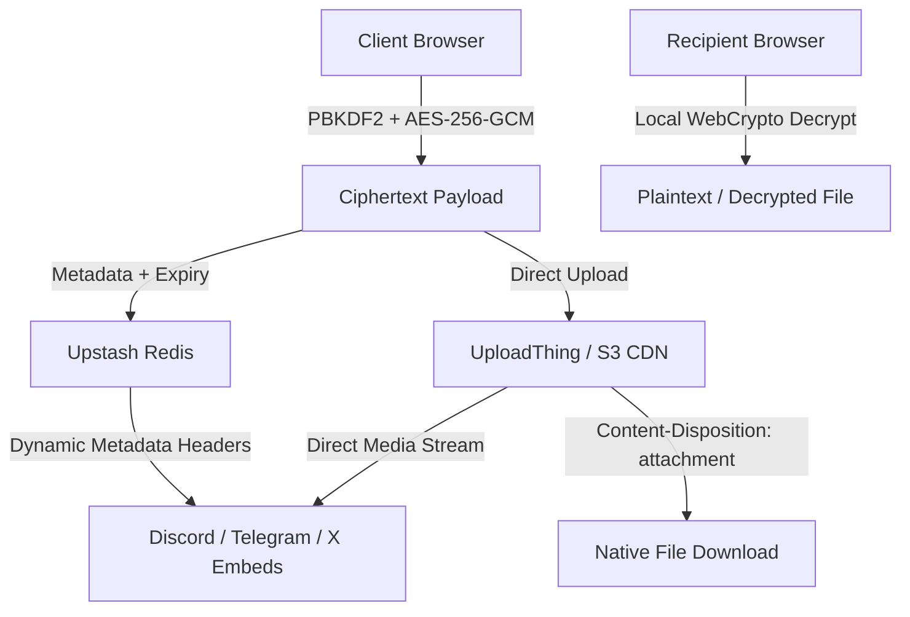
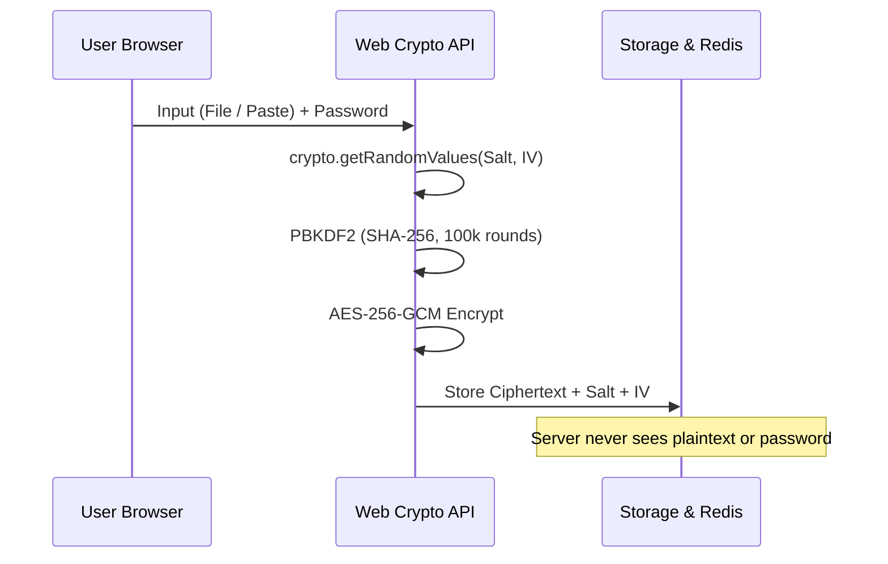

# Technical Specification & Code Architecture

<p align="center">
  
  
  
  
  
  
</p>

---

### Architecture Flow



---

### Encryption Pipeline



---

### API Endpoints

| Method | Endpoint | Description | Response |
|---|---|---|---|
| `POST` | `/api/share` | Create encrypted or public share | `{ id, expires_at }` |
| `GET` | `/api/share/[id]` | Fetch metadata & public content | Share JSON |
| `POST` | `/api/share/[id]` | Unlock password-protected share | Decryption payload |
| `GET` | `/api/share/[id]/download` | Direct stream with attachment header | File Binary Stream |
| `GET` | `/[id]/raw` | Raw plaintext stream | Plaintext |
| `DELETE` | `/api/cron/cleanup` | Expiry cleanup worker | `{ deleted: count }` |

---

### Environment Configuration

```env
# Storage & Database
UPLOADTHING_TOKEN=
UPSTASH_REDIS_REST_URL=
UPSTASH_REDIS_REST_TOKEN=

# App & CDN
NEXT_PUBLIC_APP_URL=https://opensharee.vercel.app
NEXT_PUBLIC_IMAGEKIT_ENDPOINT=
CRON_SECRET=
```

---

### Directory Map

```
src/
├── app/
│   ├── [id]/
│   │   ├── layout.tsx         # Dynamic Discord / OG embed cards
│   │   ├── page.tsx           # Decryption gate & media viewer
│   │   └── raw/route.ts       # Raw plaintext endpoint
│   ├── api/
│   │   ├── share/             # Share CRUD & /download streaming
│   │   ├── cron/cleanup/      # Automated expiry cleanup
│   │   └── uploadthing/       # UploadThing edge router
│   ├── icon.svg               # Vector favicon & badge
│   ├── opengraph-image.tsx    # Edge-generated OG preview card
│   └── page.tsx               # Mac studio upload & paste interface
├── components/                # UI components & SVG icons
├── lib/                       # WebCrypto, CDN, DB, and constants
└── styles/                    # Global Tailwind & hardware cursor
```
