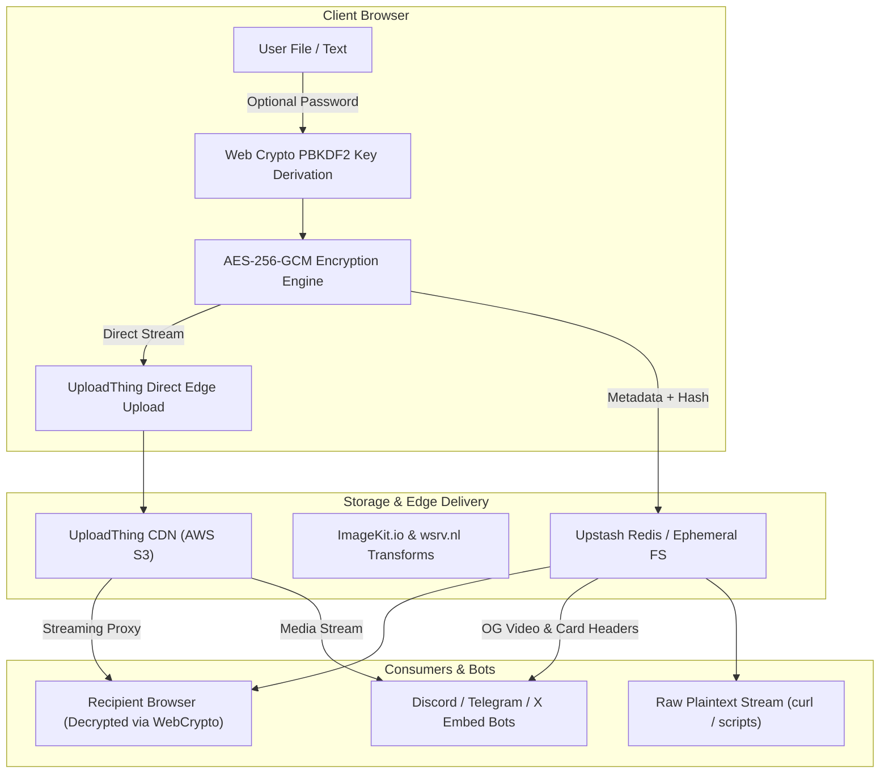

# OpenShare Architecture & Technical Specification

> Detailed technical documentation, architecture specifications, cryptographic models, and API interfaces for OpenShare.

---

## 1. Technical Architecture

OpenShare is built with Next.js 15 App Router using React 19, TypeScript, and Tailwind CSS. The platform operates on a zero-account model where files and pastes are encrypted client-side before leaving the user's browser.



---

## 2. Tech Stack

| Layer | Technology | Purpose |
|---|---|---|
| **Framework** | Next.js 15 (App Router) | Server-side rendering, API routes, edge layouts |
| **Language** | TypeScript (Strict) | End-to-end type safety |
| **UI & Styling** | Tailwind CSS + Native CSS | macOS window studio, custom cursors, responsive layouts |
| **Animation** | GSAP 3 + Native CSS | Scroll reveals, stagger animations, View Transitions wave |
| **Icons** | Pure Inline SVG | Zero-dependency crisp iconography |
| **File Storage** | UploadThing + Local FS | Large file uploads up to 512MB |
| **Database** | Upstash Redis + JSON Fallback | Share metadata, expiring keys, and public archives |
| **CDN Pipeline** | ImageKit.io + wsrv.nl | On-the-fly media optimization, video posters |
| **Cryptography** | Web Crypto API | Client-side AES-GCM + PBKDF2 (100k rounds) |
| **Markdown** | `react-markdown` + `remark-gfm` | Live GitHub-flavored Markdown rendering |
| **Analytics** | Microsoft Clarity | Heatmaps and session analytics |
| **Package Manager** | `pnpm` | Fast, deterministic dependency management |

---

## 3. Cryptography & Security Model

```
                    Plaintext Data
                          │
  Password ───────────────┼───────────────► Salt (crypto.getRandomValues 16B)
                          ▼
            PBKDF2 Derivation (100,000 rounds)
            SHA-256 Digest ──► 256-bit Key
                          │
                          ▼
              AES-256-GCM Encryption
            IV (crypto.getRandomValues 12B)
                          │
                          ▼
             Ciphertext + Auth Tag (16B)
                          │
                          ▼
                    Uploaded to CDN
```

1. **Entropy Generation**: A cryptographic salt (16 bytes) and Initialization Vector (12 bytes) are generated via `window.crypto.getRandomValues()`.
2. **Key Derivation**: Passwords pass through PBKDF2 using SHA-256 with 100,000 iterations to yield an AES-256 key.
3. **Encryption**: AES-256-GCM produces ciphertext along with an authenticated tag, guaranteeing both confidentiality and integrity.
4. **Zero-Knowledge**: The server never receives or stores the plaintext password. Without the password, content cannot be decrypted by anyone, including server administrators.

---

## 4. Media & Discord Embed Pipeline

For Discord, Telegram, Twitter/X, and social messengers, OpenShare exposes dynamic Open Graph and Twitter Card tags in `src/app/[id]/layout.tsx`:

- **Inline Video Player**: OpenGraph `video.other` with `og:video`, `og:video:type`, and `twitter:player:stream` allow videos to play directly inline in chat.
- **Dynamic Headers**: `export const dynamic = "force-dynamic"` guarantees fresh metadata per share ID without stale build caching.
- **Dedicated Attachment Streaming**: The `/api/share/[id]/download` endpoint streams files with `Content-Disposition: attachment; filename="..."`, ensuring clicks trigger instant browser downloads instead of opening video playback tabs.

---

## 5. API Reference

### `POST /api/share`
Creates a new share record.
- **Body**:
  ```json
  {
    "type": "file | paste",
    "content": "string (URL or paste content)",
    "password": "string (optional)",
    "encrypted": false,
    "encryption_salt": "string (optional)",
    "encryption_iv": "string (optional)",
    "expiry": 86400,
    "is_public": true,
    "file_name": "string",
    "file_size": 1048576,
    "file_type": "video/mp4"
  }
  ```
- **Response**: `{ "id": "o9TjqAcF", "expires_at": 1790872970160 }`

### `GET /api/share/[id]`
Retrieves metadata. If password protected, returns metadata only until unlocked via `POST`.

### `GET /api/share/[id]/download`
Streams the underlying file with `Content-Disposition: attachment`.

### `GET /[id]/raw`
Direct plaintext endpoint for code and Markdown shares.

### `DELETE /api/cron/cleanup`
Cron hook that deletes expired items from Redis and storage.
- **Header**: `Authorization: Bearer <CRON_SECRET>`

---

## 6. Directory Structure

```
OpenShare/
├── src/
│   ├── app/
│   │   ├── [id]/
│   │   │   ├── layout.tsx         # Dynamic Open Graph & Twitter embed cards
│   │   │   ├── page.tsx           # Share viewer & decryption gate
│   │   │   └── raw/route.ts       # Plaintext raw content endpoint
│   │   ├── api/
│   │   │   ├── share/             # Share CRUD & download streaming
│   │   │   ├── cron/cleanup/      # Automated expiry cleanup
│   │   │   └── uploadthing/       # Direct S3 upload router
│   │   ├── icon.svg               # Native scalable SVG favicon
│   │   ├── opengraph-image.tsx    # Dynamic branded social preview card
│   │   └── page.tsx               # Mac studio upload & paste interface
│   ├── components/                # UI components, modals, and pure SVGs
│   ├── hooks/                     # Custom GSAP and theme hooks
│   ├── lib/                       # Database, cryptography, CDN, and constants
│   └── styles/                    # Global Tailwind directives & cursors
├── CODE.md                        # Technical architecture specifications
├── CONTRIBUTING.md                # Contribution workflow & guidelines
└── README.md                      # Presentative project landing
```
